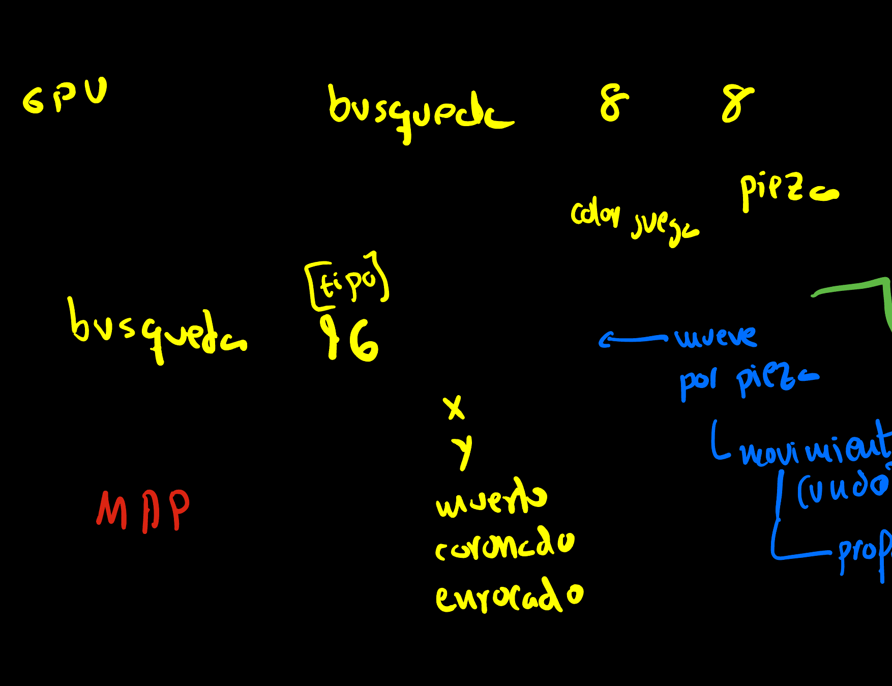
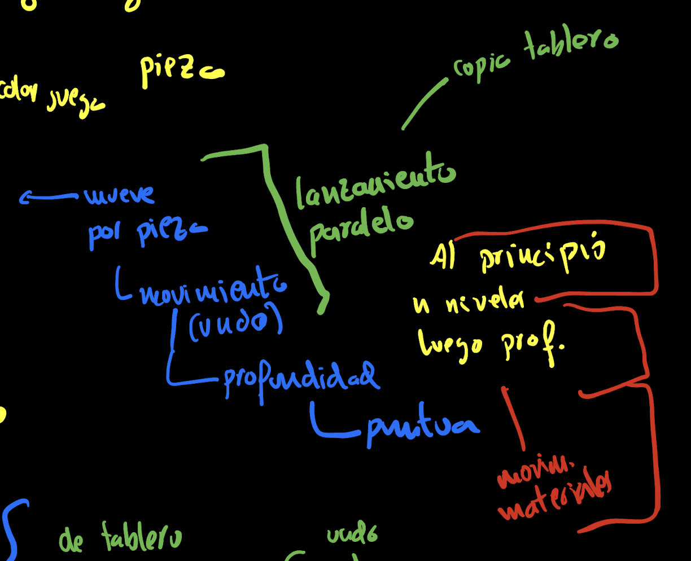
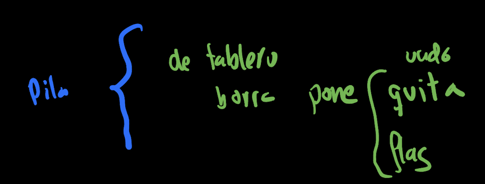
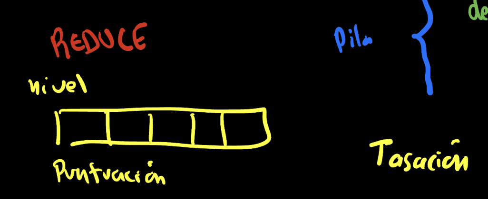

# Design Notes
# GPU Implementation

The first thing we studied is implementing the chess game using GPU.
The data structure representing the board would have the indices of:
- search 8 8

On these indices, the piece would be stored.
And at a global level in the search, the color of the player whose turn it is to play.

Similar to a doubly linked list, and knowing that there are no more than 32 pieces on the board, we can use the search index and type, the latter being one of the types of chess pieces and their color.

- search type

On this pair of indices, we would store the X, Y position of the piece, if it has died, if it has been promoted, and if it has been castled.

- X, Y, dead?, promoted, castled.

Like any exploration process, there is a part of MAP and another part of Reduce. At this point, there seems to be a contradiction. On one hand, we know that it is more efficient to make incremental changes within the same memory space when making a move and performing a depth search. But on the other hand, the GPU is designed to work in parallel, and it might initially seem more interesting to explore different possibilities by making copies of boards to examine the tree.

This apparent contradiction can be resolved by programming a search for the initial parallel phase and continuing with a depth search.

There will actually be a third element, a way of exploring that will only explore materialistic moves, where one piece captures another.

Una Una estructura que me parecía muy interesante, es una pila que afecta todas la estructura de datos y que guarda solamente información de los cambios. Sigue por lo tanto una pila de tableros en los que no habría una copia y cuando alguien preguntara algo tendría que atravesarla. Esta pila estaría optimizada para funciones de añadir, quitar y mantener lo que son los Flag. Los Flaix son tres el hindú, la pieza que se quita y las banderas que son necesarias para el estado del tablero.

Por último, la otra parte del Reduce, Contiene la tasación de las distintos tableros, es decir, lo que es la función heurística. Como el segundo nivel de búsquedas es un recorrido en profundidad, pues sería interesante mantener dicha tasación por niveles. De tal forma que se facilite el algoritmo alfabeta o maxmin.

# Autodiff en chess