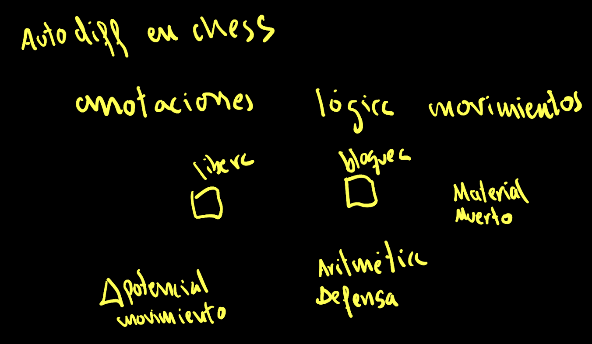
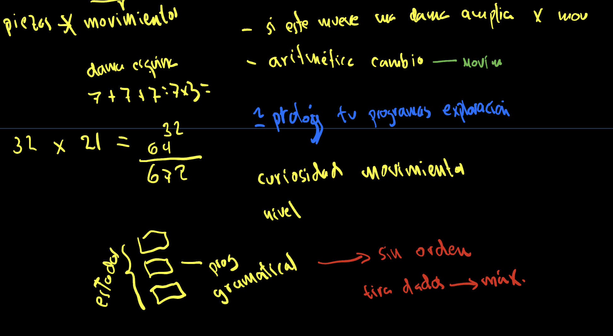
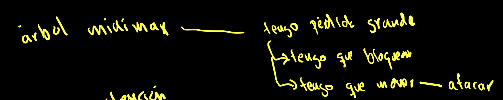
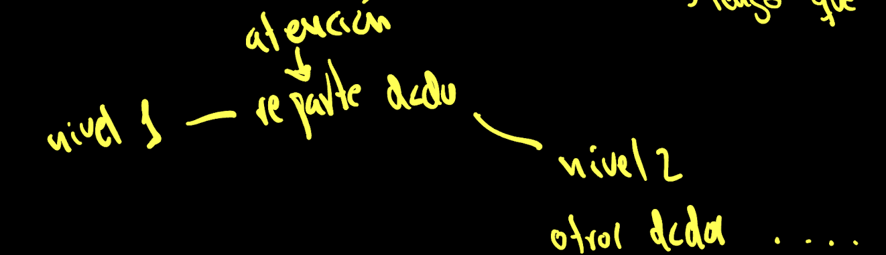
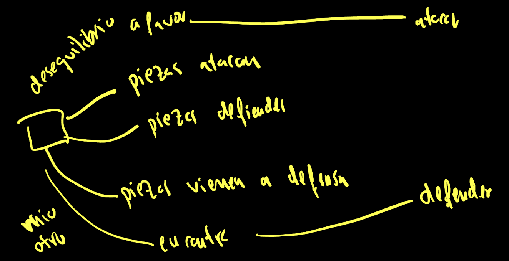
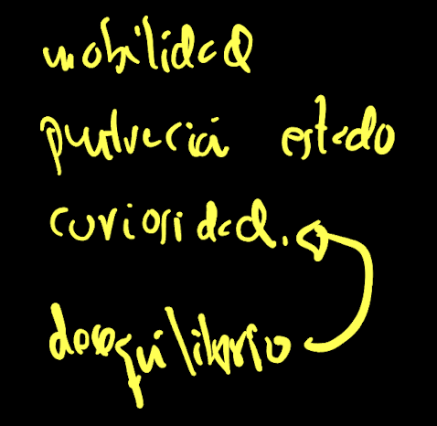
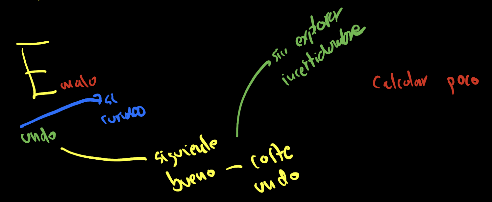
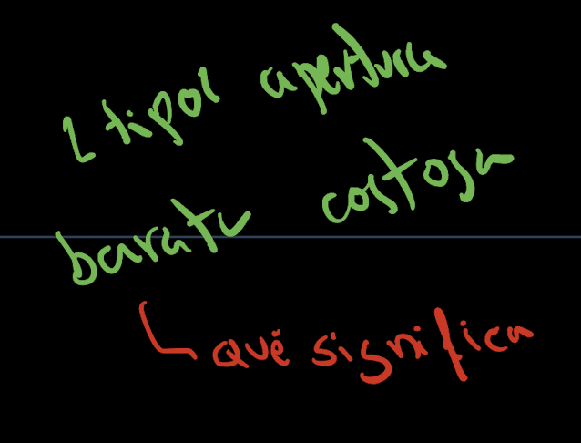
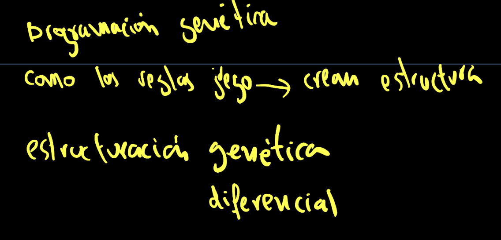
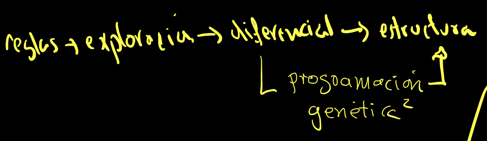

# Design Notes
# GPU Implementation

The first thing we studied is implementing the chess game using GPU.
The data structure representing the board would have the indices of:
- search 8 8

On these indices, the piece would be stored.
And at a global level in the search, the color of the player whose turn it is to play.

Similar to a doubly linked list, and knowing that there are no more than 32 pieces on the board, we can use the search index and type, the latter being one of the types of chess pieces and their color.

- search type

On this pair of indices, we would store the X, Y position of the piece, if it has died, if it has been promoted, and if it has been castled.

- X, Y, dead?, promoted, castled.

Like any exploration process, there is a part of MAP and another part of Reduce. At this point, there seems to be a contradiction. On one hand, we know that it is more efficient to make incremental changes within the same memory space when making a move and performing a depth search. But on the other hand, the GPU is designed to work in parallel, and it might initially seem more interesting to explore different possibilities by making copies of boards to examine the tree.

This apparent contradiction can be resolved by programming a search for the initial parallel phase and continuing with a depth search.

There will actually be a third element, a way of exploring that will only explore materialistic moves, where one piece captures another.

One structure that seemed very interesting to me is a stack that affects the entire data structure and only stores information about the changes. Therefore, it follows a stack of boards where there would be no copy, and when someone asks something, they would have to traverse it. This stack would be optimized for functions of adding, removing, and maintaining what are the Flags. The Flags are three: the hindrance, the piece that is removed, and the flags that are necessary for the state of the board.

Finally, the other part of the Reduce contains the evaluation of the different boards, that is, what the heuristic function is. Since the second level of searches is a depth-first traversal, it would be interesting to maintain this evaluation by levels. In such a way that it facilitates the alpha-beta or minimax algorithm.

An interesting idea for searches is not only to perform them by pieces but also by potential movements, particularly the piece with the most movements. For example, a queen positioned in a corner. Since we have 32 pieces, the total number of movements would be 672.

# Autodiff in Chess
The idea is to apply autodifferentiation to the chess movement rules. It would be like making annotations on both the squares and the pieces, but mainly the pieces. The underlying data structures are as subtle as freeing up a square because new pieces can move or blocking a square because pieces can no longer move. There are processes like dead material where there is an obvious connection between gradients and a penalty. Any move can be seen as a differential of the potential, how much it was worth before and how much the new scenario is worth now. Another interesting element is the arithmetic of defense or, in simpler terms, those pieces that are unprotected.

Since it is a redundant data structure, we can say that it is the opposite of database normalization. There are two main elements: exploratory curiosity and spring learning.

Prolog es un buen ejemplo de lo que queremos hacer, puedes añadir variables de entrada o de salida y el sistema funciona como una ecuación.

Hay una aritmática del cambio que definen los movimientos o como llegar a una determinada posición.

Esta gramática tipo prolog se puede convinar con los estados. 

Al igual que prolog, en el que tenemos un lenguaje que razona, aquí tenemos un alógica que opera con el algoritmo maximización minimización.

Por ejemplo, si tenemos una perdida grande en una casilla tengo que bloquear el ataca, mover para defender o atacar.

Se me pasa por la cabeza combinar prolog con autodiferenciación.

Ordenar es un proceceso muy costoso. Pero si escogemos a cinco elementos a azar y nos quedamos con el máximo es una forma de ordenación.
Los sucesivos niveles pueden recibir un potencial de exploración, una serie de tiradas de dados.

Miro como se generan los números al azar: (dado*m+c) % escala. Hay ciertas restricciones para que no se repitan las secuencias. Con números primos.

En cualquier caso siempre que la aritmética produzca un desequilibrio, dependiendo de a quien le toque habrá que atacar o defender, o incluso traer piezas que vienen en defensa. 

Un desequilibrio conduce a una curiosidad por explirar ciertos movimientos.

Estas son las bases del aprendizaje por refuerzo contados de otra forma.

Recuerda que nosotros exploramos, si hay algún caso malo, no tenemos que explorar mas. 
Esto entra dentro del sacrificio.
Podemos tener anotado la curiosidad que nos quedó la última vez, si queremos hacer un undo y volver al estado previo.

Si acompañaramos a un concepto de incertidumbre. Es como toda la teoría de A*. Si tienes en cuenta el coste de undo, llega un momento que se explorará.

En definitiva hemos visto dos tipos de aperturas, unas baratas y otras con datos entrelazados, costosas.

Aquí lo interesantes es saber como la programación genética puede crear estructuras. 
Lo que sería llamado una estructuración genética diferencial.

Mas concretamente recordemos que pasamos de las reglas de ajedrez, a hacer un recorrido exploratorio, y arrastrando del cálculo diferencial luego tenemos estructuras de datos.

El paso de diferencial a estructural requiere una programación genética al cuadrado. Porque hemos de generar reglas y luego esas reglas se simulan, mas concretamente como algoritmos genéticos.

Now we return to thinking about how reinforcement learning works.