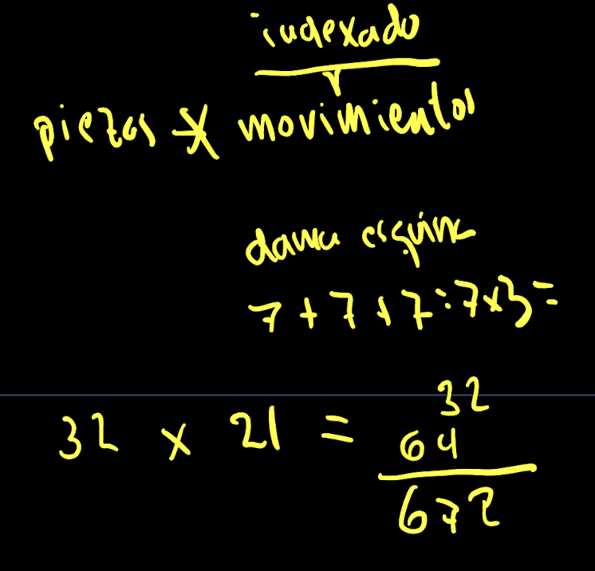
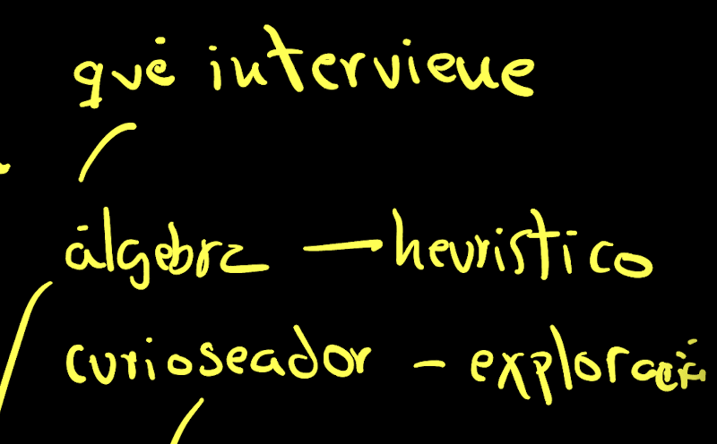
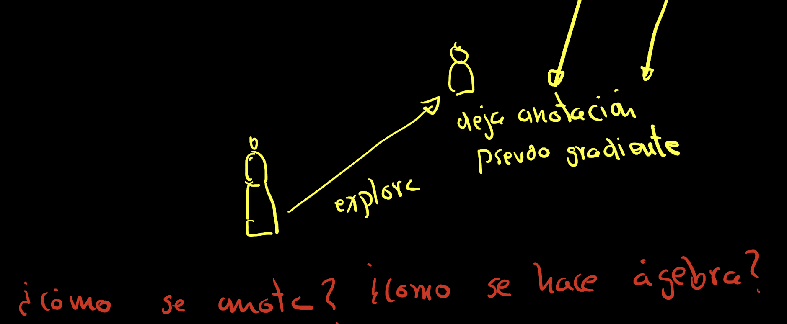
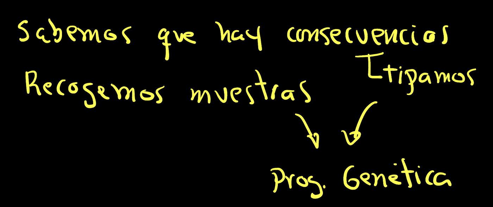
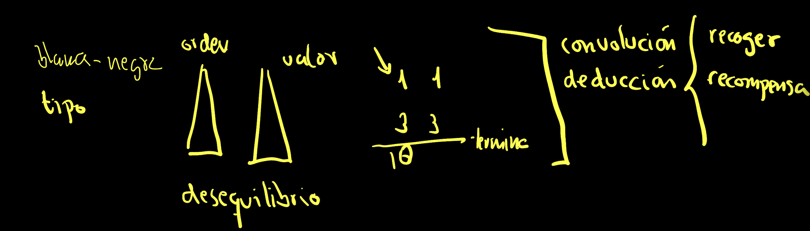
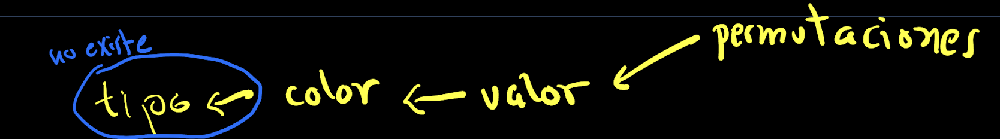
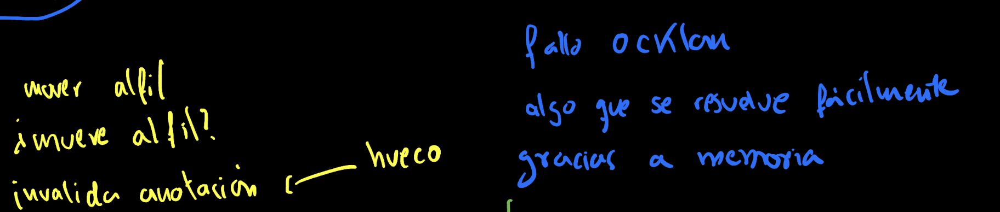
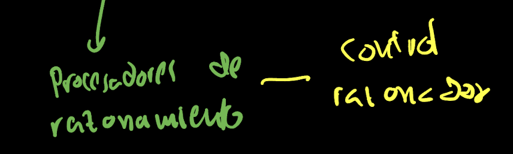
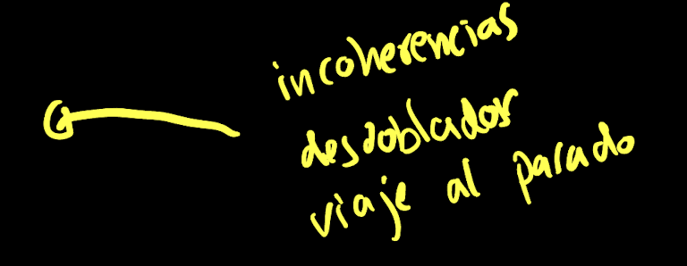

# Design Notes
# GPU Implementation

The first thing we studied is implementing the chess game using GPU. The data structure representing the board would have the indices of:
- search 8 8

On these indices, the piece would be stored. And at a global level in the search, the color of the player whose turn it is to play.

Similar to a doubly linked list, and knowing that there are no more than 32 pieces on the board, we can use the search index and type, the latter being one of the types of chess pieces and their color.

- search type

On this pair of indices, we would store the X, Y position of the piece, if it has died, if it has been promoted, and if it has been castled.

- X, Y, dead?, promoted, castled.

Like any exploration process, there is a part of MAP and another part of Reduce. At this point, there seems to be a contradiction. On one hand, we know that it is more efficient to make incremental changes within the same memory space when making a move and performing a depth search. But on the other hand, the GPU is designed to work in parallel, and it might initially seem more interesting to explore different possibilities by making copies of boards to examine the tree.

This apparent contradiction can be resolved by programming a search for the initial parallel phase and continuing with a depth search.

There will actually be a third element, a way of exploring that will only explore materialistic moves, where one piece captures another.

One structure that seemed very interesting to me is a stack that affects the entire data structure and only stores information about the changes. Therefore, it follows a stack of boards where there would be no copy, and when someone asks something, they would have to traverse it. This stack would be optimized for functions of adding, removing, and maintaining what are the Flags. The Flags are three: the hindrance, the piece that is removed, and the flags that are necessary for the state of the board.

Finally, the other part of the Reduce contains the evaluation of the different boards, that is, what the heuristic function is. Since the second level of searches is a depth-first traversal, it would be interesting to maintain this evaluation by levels. In such a way that it facilitates the alpha-beta or minimax algorithm.

An interesting idea for searches is not only to perform them by pieces but also by potential movements, particularly the piece with the most movements. For example, a queen positioned in a corner. Since we have 32 pieces, the total number of movements would be 672.

# Autodiff in Chess

The idea is to apply autodifferentiation to the chess movement rules. It would be like making annotations on both the squares and the pieces, but mainly the pieces. The underlying data structures are as subtle as freeing up a square because new pieces can move or blocking a square because pieces can no longer move. There are processes like dead material where there is an obvious connection between gradients and a penalty. Any move can be seen as a differential of the potential, how much it was worth before and how much the new scenario is worth now. Another interesting element is the arithmetic of defense or, in simpler terms, those pieces that are unprotected.

Since it is a redundant data structure, we can say that it is the opposite of database normalization. There are two main elements: exploratory curiosity and spring learning.

Prolog is a good example of what we want to do, you can add input or output variables and the system works like an equation.

There is an arithmetic of change that defines the movements or how to reach a certain position.

This Prolog-like grammar can be combined with the states.

Just like Prolog, in which we have a language that reasons, here we have a logic that operates with the maximization-minimization algorithm.

For example, if we have a big loss on a square, I have to block the attack, move to defend, or attack.

It occurs to me to combine Prolog with autodifferentiation.

Sorting is a very costly process. But if we choose five elements at random and keep the maximum, it is a way of sorting. The successive levels can receive a potential for exploration, a series of dice rolls.

I look at how random numbers are generated: (dice*m+c) % scale. There are certain restrictions so that the sequences do not repeat. With prime numbers.

In any case, whenever the arithmetic produces an imbalance, depending on whose turn it is, there will be a need to attack or defend, or even bring pieces that come in defense.

An imbalance leads to curiosity to explore certain movements.

These are the basics of reinforcement learning told in another way.

Remember that we explore, if there is a bad case, we do not have to explore more. This falls within the sacrifice. We can have noted the curiosity that we had last time if we want to undo and return to the previous state.

If we accompany a concept of uncertainty. It is like the whole theory of A*. If you take into account the cost of undo, there comes a time when it will be explored.

In short, we have seen two types of openings, some cheap and others with interlaced data, costly.

Here the interesting thing is to know how genetic programming can create structures. What would be called differential genetic structuring.

More specifically, remember that we go from the chess rules to making an exploratory tour, and dragging from the differential calculation we then have data structures.

The step from differential to structural requires genetic programming squared. Because we have to generate rules and then those rules are simulated, more specifically as genetic algorithms.

Now we return to thinking about how reinforcement learning works.

Reinforcement learning involves two neural networks: one that tells you the value of the states and more specifically the path or reward, and another neural network that tells you which of the possible paths we have more exploratory curiosity about.

These elements leave annotations on the pieces for others to explore. One of the annotations is the movement that can reach a certain piece. We have to understand the relationship between the pseudo-gradient and the algebra or curiosity.

We need to connect autodifferentiation with the consequences. One way would be to collect samples. These samples would need to add more information about the types so that genetic programming is possible.

For example, when there is an imbalance, it means that there are several pieces, for example, a pawn that is threatened by another pawn and a bishop but is in turn defended by another bishop. In the end, if we start calculating the exchanges, a queen worth 10 points will remain. The aroma is complex because it has to classify in order of value all the pieces that point to a certain one to calculate the imbalance. If it were a neural network, this would be typical of a convention discussion, which would be fed with the collected data or the reinforcement learning reward mechanism.

As you can imagine, conceiving this type of structure as if it were genetic programming is very difficult. It doesn't have to be exactly like that. Instead, something that approximates it. Let's conceive that along with the gradient, we have extra information about the type of piece, color, and its value, and let's think of a system of permutations that allow us to create the evolution.

Or in other words, the order in which the different types should be worked on to have something approximate.

The type of piece could be ignored because the value would be enough.

What happens to us is a failure of Oakland's razor rule. We had the memory capacity of computers, and with it, we could solve many tasks easily. Imagine for a moment that it is very difficult to erase. In such a processor, we would program the movement instruction of a bishop, but we would also program a specific square if the bishop can move there. Invalidating the notation that a certain piece can pass through a gap would be difficult.

It would be feasible to create processors oriented towards reasoning. This is an alternative to Nvidia's architecture. These processors would have a control stage guided by a reasoner.

Another way to think about it is to perform all operations simultaneously and detect inconsistencies. If there are inconsistencies, we do a rollback of the execution and go back to the past to now execute those two scenarios without the detected inconsistency.

